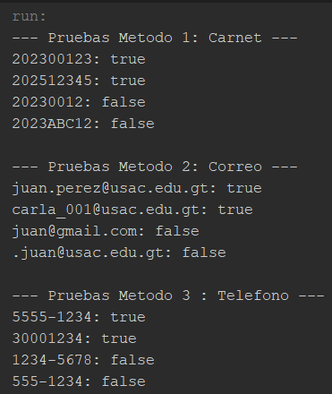
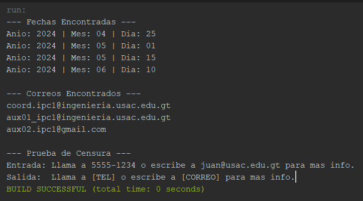

# Tarea 11 - Expresiones Regulares en Java (java.util.regex)
**Curso:** Introducción a la Programación y Computación 1  
**Estudiante:** Carlos Alfonzo Jared González Sagastume
**Carnet:** 202500177

---

## Evidencias de Ejecución

### Ejercicio 1: Validador de Datos
*(Validación de Carnet, Correo Institucional y Teléfono)*

---

### Ejercicio 2: Extractor y Transformador
*(Extracción de fechas, correos y censura de datos sensibles)*

