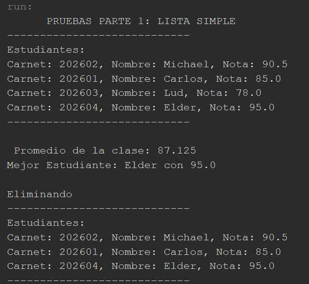
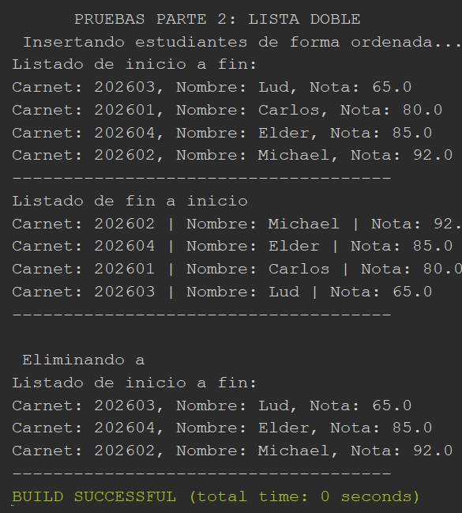
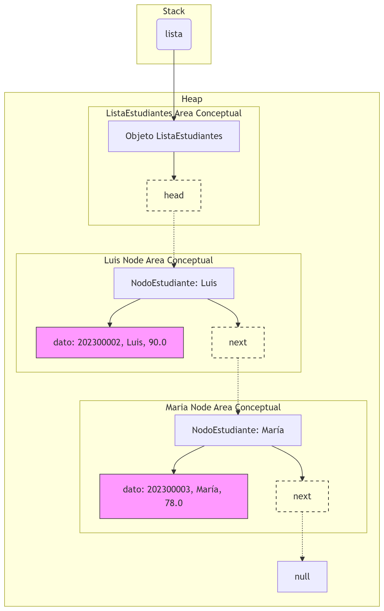

# Análisis - Tarea 9 (IPC1)
**Estudiante:** Carlos Alfonzo Jared González Sagastume 202500177

## Evidencias

---

## Pregunta 1
**¿Cuál es la complejidad Big-O de `insertarOrdenado`?**
* **Complejidad:** $O(n)$
* **Justificación:** Aunque insertar en los extremos es $O(1)$, en el peor de los casos (insertar en medio) se debe recorrer la lista nodo por nodo con un bucle `while` para encontrar la posición, lo que toma un tiempo proporcional al número de elementos ($n$).

---

## Pregunta 2
**Indica si sería más eficiente usar un Array o una Lista Enlazada y por qué:**

* **Buscar al estudiante con carnet 202300001:** **Array.** Ambos requieren $O(n)$ si no están ordenados, pero el Array es más rápido a nivel de CPU por su asignación de memoria contigua (localidad de caché).
* **Agregar 500 estudiantes nuevos al inicio:** **Lista Enlazada.** Toma $O(1)$ por cada nodo. En un Array tomaría $O(n)$ ya que habría que desplazar todos los elementos existentes hacia la derecha cada vez.
* **Acceder directamente al 3er estudiante:** **Array.** Permite acceso aleatorio por índice en $O(1)$. En la lista habría que recorrer desde el inicio ($O(n)$).

---

## Pregunta 3
**Dibujo de la memoria Heap tras las**

